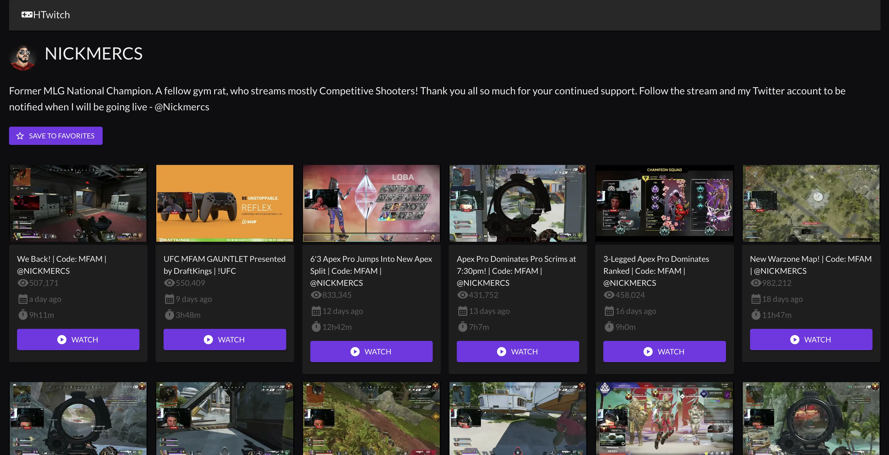
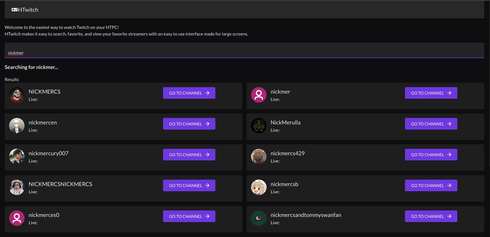
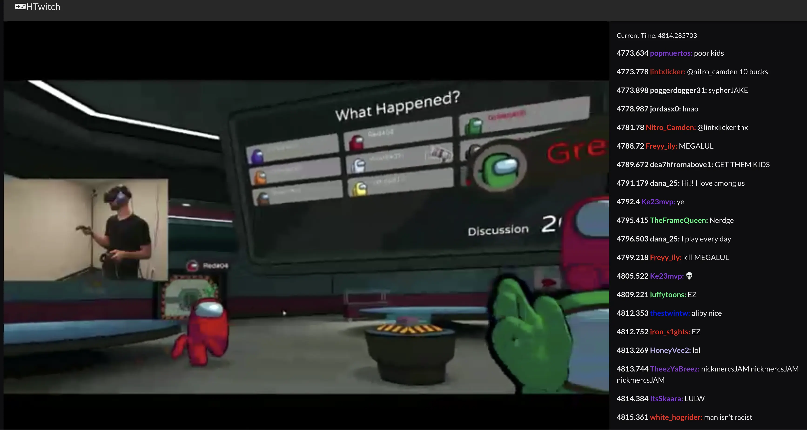

# HTwitch
#### A Twitch player for people who watch Twtich on their TVs using an HTPC.
Especially catered to OLED TVs which are prone to burn in with the static text/overlays that other Twich viewers provide

## Screenshots




## Features
- Search for channels
- Favorite channels
- Go directly to a streams videos
- Large UI icons making it easy to select items with a bluetooth mouse
- Video/Chat display automatically resizes itself every 60 seconds to avoid OLED burn-in


## Future Features
- Support for live streams (currently only supports VODs)
- Persisting favorites between re-starts (currently only held in react state)


## Technologies Used
- NextJS (React framework)
- Twitch API
- MUI


## Setup
Clone the `.env.local.example` file into `.env.local` and fill out the variables with your Twitch credentials
```
npm install
npm run dev
```


## License
HTwitch is open source under the GNU Affero General Public License Version 3 (AGPLv3).

[License](https://github.com/MarbleMetrics/MarbleMetrics/blob/prod/LICENSE.md)